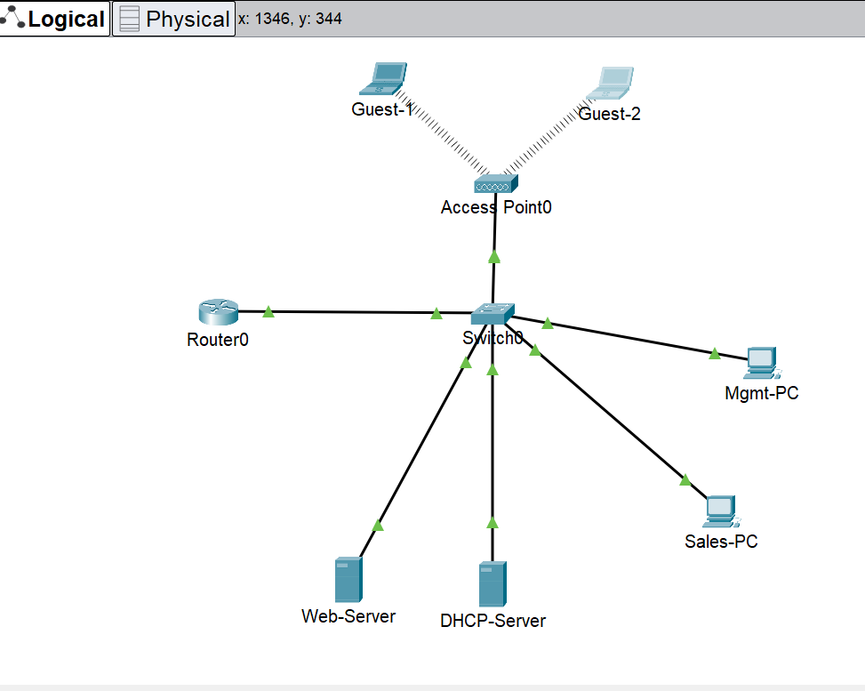

# Small Business Network Lab for "Prestridge Woodworking HQ"

## 1. Project Objective
The goal of this project is to design and configure a secure and segmented network for a hypothetical small business. This lab demonstrates fundamental networking concepts including VLANs, inter-VLAN routing, DHCP services, and security using Access Control Lists (ACLs).

## 2. Network Topology

## 3. IP Addressing Scheme & VLAN Table
The network uses the `192.168.0.0` block, segmented into the following VLANs:

| VLAN ID | Name        | Network Address     | Gateway             | Purpose                                  |
|---------|-------------|---------------------|---------------------|------------------------------------------|
| 10      | Management  | `192.168.10.0/24`   | `192.168.10.1`      | PCs for managers, access to all areas.   |
| 20      | Sales       | `192.168.20.0/24`   | `192.168.20.1`      | PCs for sales staff.                     |
| 30      | Guest WiFi  | `192.168.30.0/24`   | `192.168.30.1`      | Laptops for guests, internet-only access.|
| 99      | Server Farm | `192.168.99.0/24`   | `192.168.99.1`      | Houses internal servers.                 |

## 4. Security Policies
The following rules will be enforced using Access Control Lists (ACLs):
- **Management (VLAN 10):** Can access all other VLANs.
- **Sales (VLAN 20):** Can access the Server Farm, but is **BLOCKED** from accessing the Management VLAN.
- **Guest WiFi (VLAN 30):** Is **BLOCKED** from accessing any internal VLAN (Management, Sales, Servers).

## 6. Lessons Learned

This project was a valuable, hands-on experience in network implementation and troubleshooting. A key takeaway was the importance of verifying configurations layer by layer. For instance, after applying the ACLs, my initial tests failed. This forced me to troubleshoot by first checking the rule's application on the interface (`show running-config interface...`) and then inspecting the ACL definition itself (`show access-lists`), which revealed the root cause.

Furthermore, this lab reinforced the critical role of the `ip helper-address` command for centralized DHCP services in a multi-VLAN environment. Finally, upgrading the guest network from a simple wired connection to a more realistic WPA2-PSK secured wireless network provided practical experience in configuring access points and wireless clients.
